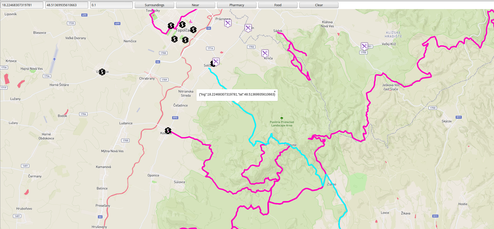

# Overview

This application shows bike path in Slovakia on a map. Most important features are:
- search for all bike paths in set distance 
- search for the closest bike path
- search for pharmacy within set distance to closest path
- search for refreshments in set distance 

This is it in action:



The application has 2 separate parts, the client which is a [frontend web application](#frontend) using mapbox API and mapbox.js and the [backend application](#backend) written in Python using framework [CherryPy](http://cherrypy.org/), backed by PostGIS. The frontend application communicates with backend using a [REST API](#api).

# Frontend

The frontend application is a static HTML page (`index.html`), which shows a mapbox.js widget. It is displays bike paths. I modified the style to better see roads and water which presents danger to cycler. They caller is now changed into red one.

All relevant frontend code is in `Cyclo/public/js/application.js` which is referenced from `index.html`. The frontend code is very simple, its only responsibilities are:
- displaying map
- displaying the buttons for and input bars for editing location and setting distance
- sending ajax calls to backend api with data

# Backend

The backend application is written in Python using CherryPy framework and is responsible for querying geo data, formatting the geojson and data to frontend.

## Data

Geo data are directly from Open Street Maps. I downloaded an extent covering whole Slovakia and imported it using `osm2pgsql` tool. I was using the guide providied by Open Street Map.
 
All queries are in `Cyklo/cherry.py`. GeoJSON is generated by using  a standard `st_asgeojson` function, however some postprocessing is necessary (in `Cyklo/cherry.py`) in order to merge all bake paths or other results into a single geojson.

## Api

**Find surroundings bike paths**

`POST /Surroundings`

`$(document).ready(function(){
    $('#One').click(function(){
         var data = {};
		   data['distance']=$('#distance').val();
		   data['lng']=$('#lng').val();
		   data['lat']=$('#lat').val();
         $.ajax({
            url: '/Surroundings',
            type: 'post',
            data: data,
            success: function (e) {
            ...
            }
        });
    });`

### Response

API calls return json responses with `geojson`. This geojson includes "geometry" and "properties" for each entry.
```
{"type": "FeatureCollection", "features": [{"geometry": {"type": "Point", "coordinates": [18.2162133113398,
48.5636184602996]}, "type": "Feature", "properties": {}}, {"geometry": {"type": "Point", "coordinates":
[18.2048918438141, 48.5396351565099]}, "type": "Feature", "properties": {}}, ...}]}
```
